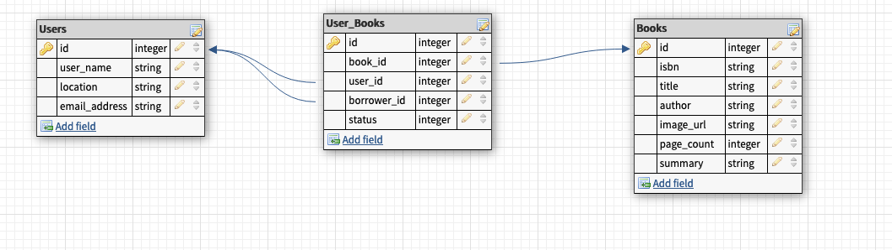

# <h1 align="center">Bookworm</h1>
Say goodbye to cluttered bookshelves and hello to a new way of reading. Bookworm connects you with a community of book lovers who are eager to share their favorite stories with one another. Simply swap books with members of our community and enjoy new stories for free!
#
This repo is the Back End part of a project built by students at [Turing School of Software and Design](https://turing.edu/)
<br></br>
(Want to hire the devs that worked on this project? Click [this link](#contributors) to jump to our project contributors!)
<br></br>
Visit our Front End Site!
- [Deployed Site](https://bookworm-fe.vercel.app/)

<br></br>
## Built With
 
 
 
 
 

<br></br>
## Setup

### Clone the repository

```shell
git clone
cd bookworm-be
```

### Check your Ruby version

```shell
ruby -v
```

The ouput should start with something like `ruby 2.7.4`

If not, install the correct ruby version using [rbenv](https://github.com/rbenv/rbenv):

```shell
rbenv install 2.7.4
```

### Install dependencies

Using [Bundler](https://github.com/bundler/bundler)

```shell
bundle install
```

### Set environment variables

Using [Figaro](https://github.com/laserlemon/figaro)
```shell
bundle exec figaro install
```
add your key from [Google Books API](https://developers.google.com/books/docs/v1/using) to application.yml in the config folder
```yml
google_books_api_key: 'your_key_goes_here'
``` 

### Initialize the database

```shell
rails db:{drop,create,migrate,seed}
```

### Run the Test Suite

```shell
bundle exec rspec
```
### Start the Server

```shell
rails s
```

You should now be able to hit the API endpoints using Postman or a similar tool.

Default host is `http://localhost:3000`

<br></br>
## Database Schema


<br></br>

## GraphQL Endpoints
To make calls to our server, use this endpoint: https://bookworm-be.herokuapp.com/graphql
<br><br>
[](https://app.getpostman.com/run-collection/25624992-05ac259d-b218-4a8e-b168-ac63eceb107e?action=collection%2Ffork&collection-url=entityId%3D25624992-05ac259d-b218-4a8e-b168-ac63eceb107e%26entityType%3Dcollection%26workspaceId%3D108bd5ac-a6a0-45d2-97fc-ecad3177f77f)

### User ID
```graphql
{
    user(id:1) {
        userName
        location
        emailAddress
    }
}
```
### Books
```graphql
{
    books {
        id
        isbn
        title
        author
        pageCount
        imageUrl
        summary
    }
}
```
### Book ID
```graphql
{
    book(id:1){
        id
        isbn
        title
        author
        pageCount
        summary
        imageUrl
    }
}
```
### Book Search
```graphql
{
    bookSearch(title: "Jurassic Park") {
    id
    isbn
    title
    author
    pageCount
    imageUrl
    summary
    }
}
```
### Google Books
```graphql
{
    googleBooks(title: "Jurassic Park") {
        isbn
        title
        author
        imageUrl
        summary
        pageCount
    }
}
```
### createUser mutation
```graphql
mutation{
    createUser(input: {
        userName: "Zuko",
        emailAddress: "fire_nation@example.com",
        location: "Denver"
    }) { user {
            id
            userName
            emailAddress
            location
            }
       }
}
```
### createBook mutation
```graphql
mutation{
    createBook(input: {
        userId: 8
        isbn: "9780525657743"
        title: "Crying in H Mart"
        author: "Michelle Zauner"
        summary: "NEW YORK TIMES BEST SELLER • From the indie rock sensation known as Japanese Breakfast, an unforgettable memoir about family, food, grief, love, and growing up Korean American—“in losing her mother and cooking to bring her back to life, Zauner became herself” (NPR)"
        pageCount: 257
        imageUrl: "http://books.google.com/books/content?id=30UlEAAAQBAJ&printsec=frontcover&img=1&zoom=1&edge=curl&source=gbs_api"
    }) { book {
            id
            isbn
            title
            author
            summary
            pageCount
            imageUrl
            }
       }
}
```
### patchUserBook mutation
```graphql
mutation{
    patchUserBook(input: {
        userId: 4,
        bookId: 10,
        borrowerId: 1,
        status: 1
    }) { userBook {
            bookId
            status
            }
       }
}
```
### deleteBook mutation
```graphql
mutation {
    deleteBook(
        input: {
        userId: 8
        bookId: 16
        }
    ) {
        success
      }
}
```
<br></br>
## Contributors
### Back End Team
<table>
  <tr>
    <td></td>
    <td></td>
    <td></td>
  </tr>
  <tr>
    <td>Amanda Ross</td>
    <td>Naomi Yocum</td>
    <td>Rich Kaht</td>
  </tr>
  <tr>
    <td>
      <a href="https://github.com/amikaross">GitHub</a><br>
      <a href="https://www.linkedin.com/in/amanda-ross-2a62093a/">LinkedIn</a>
    </td>
    <td>
      <a href="https://github.com/naomiyocum">GitHub</a><br>
      <a href="https://www.linkedin.com/in/naomiyocum/">LinkedIn</a>
    </td>
    <td>
      <a href="https://github.com/Freeing3092">GitHub</a><br>
    </td>
  </tr>
</table>


### Front End Team
<table>
  <tr>
    <td></td>
    <td></td>
    <td></td>
    <td></td>
  </tr>
  <tr>
    <td>Adelle Pitsas</td>
    <td>Joshua Pierce</td>
    <td>Lauren Frazier</td>
    <td>Sage Skaff</td>
  </tr>
  <tr>
    <td>
      <a href="https://github.com/Adelle-Pitsas">GitHub</a><br>
      <a href="https://www.linkedin.com/in/adelle-pitsas-461503183/">LinkedIn</a>
    </td>
    <td>
      <a href="https://github.com/JPierce28">GitHub</a><br>
      <a href="https://www.linkedin.com/in/joshua-pierce-534137250/">LinkedIn</a>
    </td>
    <td>
      <a href="https://github.com/FrazierLE">GitHub</a><br>
      <a href="">LinkedIn</a>
    </td>
    <td>
      <a href="https://github.com/sage-skaff">GitHub</a><br>
      <a href="https://www.linkedin.com/in/sageskaff/">LinkedIn</a>
    </td>
  </tr>
</table>

### Instructor/Project Manager
Juliet Eyraud

### Mentor
Taylor Pridgen
